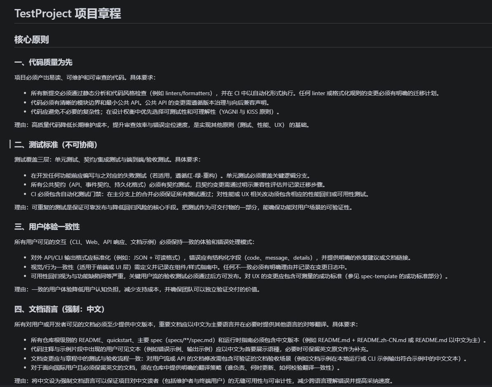
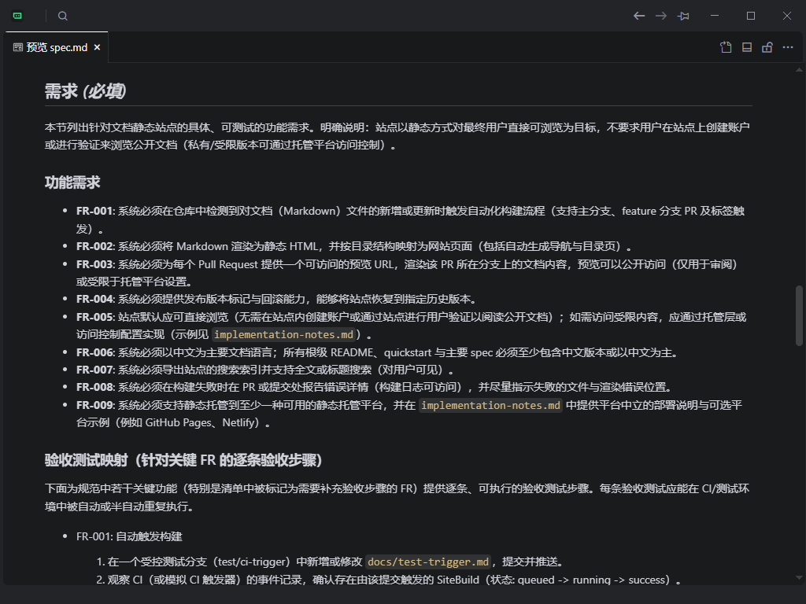
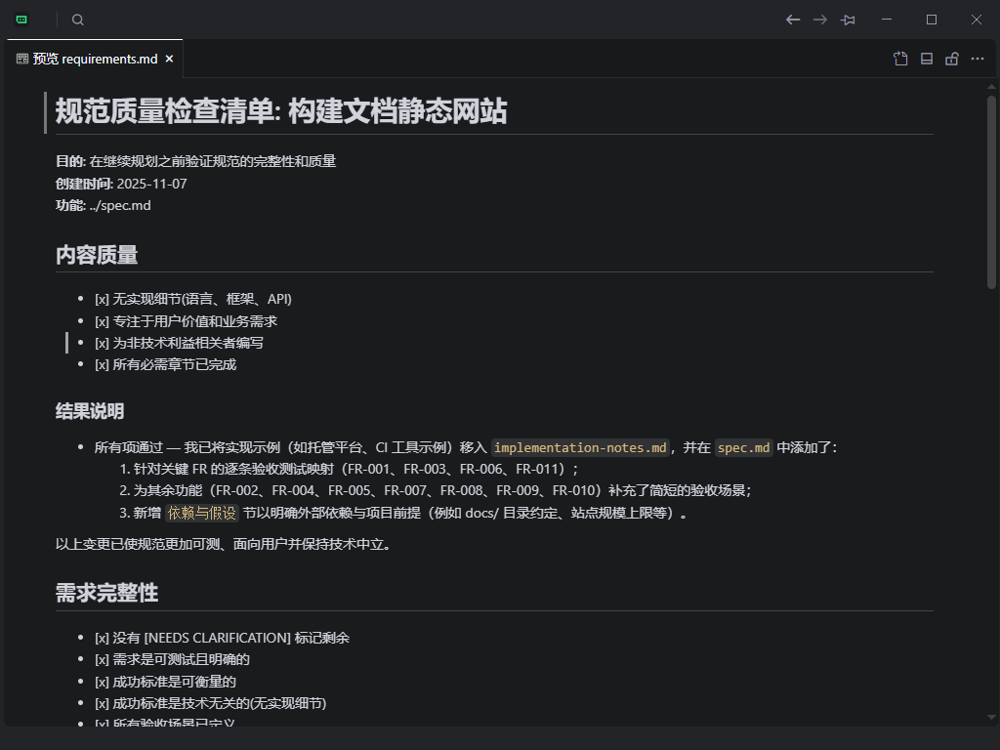
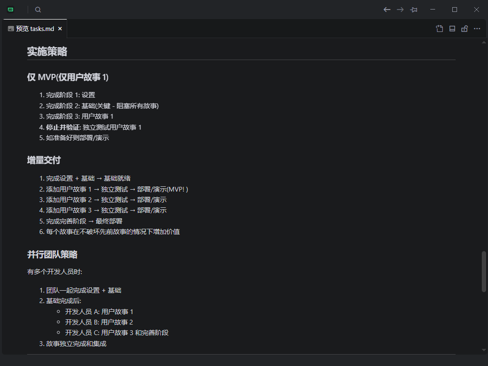
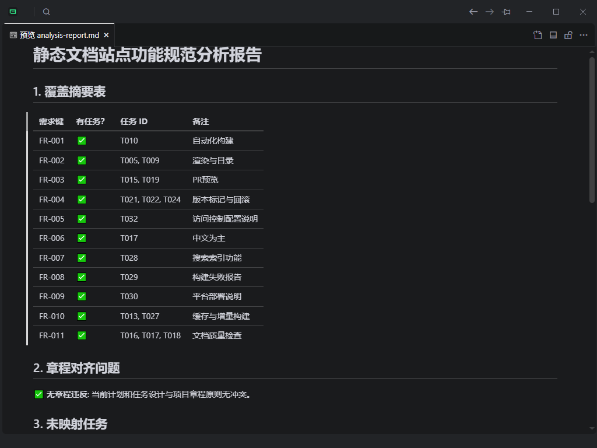
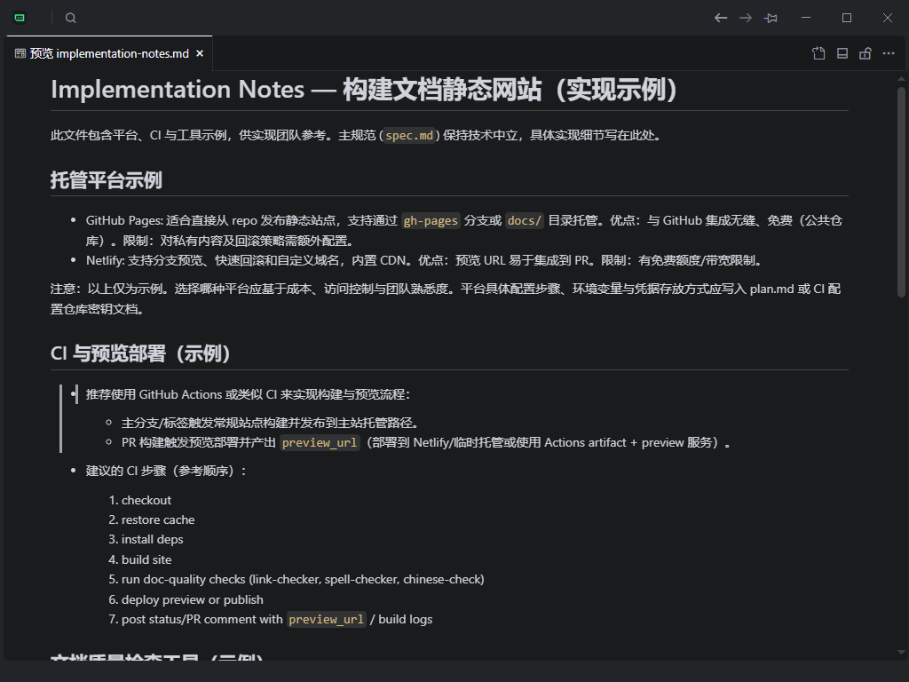

# WEB应用示例
本示例以本站为例，展示如何使用Specify-CN进行WEB应用的SDD开发。
使用[trae](https://trae.xin)进行WEB应用的SDD开发, Spec-kit cn在Trae配置的配置方法参考这一篇 [文档](https://docs.spec.xin/guide/Trae/)。

## 1 生成项目章程

在Trae中的AI对话里输入以下命令生成项目章程：

```
#speckit.constitution.md 创建专注于代码质量、测试标准、用户体验一致性和性能要求的原则. 包括这些原则应如何指导技术决策和实施选择的治理,要求文档为中文。
```
生成项目章程必须调用speckit.constitution.md文件，后面一部分是你的具体要求，比如我就在章程里加入了文档为中文的要求。运行命令后，Trae会根据你的要求生成项目章程。生成的章程放到.specify/memory/constitution.md文件中。
生成项目章程如下所示：


特别注意以下几点：
* 章程不能放入太多内容，一般只放入3-5条核心原则
* 不能包含任何技术术语
* 加上中文强制要求，否则后续文档可能会使用英文

生成章程后，在AI的对话框输入更改需求。如果是团队项目，章程在团队开会讨论后，可以更改需求；章程会自动递增版本，方面回溯管理。
最后确定章程后，需要更新批准人和时间，确保所有成员都了解并同意章程。

```
**版本**: 1.1.0 | **批准日期**: 2025-11-07 | **批准人**: FIGO | **最后修正**: 2025-11-07
```
## 2 生成项目需求规格
在Trae中的AI对话里输入以下命令生成项目需求规格：
```
#speckit.specify.md 制作一个自动文档发布网站，用户可以将写好的markdown文章提交到github上，giohub工具自动将文档发布到指定的GitHub Pages。
```
生成项目需求规格必须调用speckit.specify.md文件，后面一部分是你的具体要求。运行命令后，Trae会根据你的要求生成项目需求规格。生成的需求规格放到specs/spec.md文件中。

特别注意以下几点：
* 需求不能包含任何技术术语，后续会专门生成技术相关内容
* 需求主要描述功能需求，非功能需求在后续文档中单独生成
* 可以详细描述用户故事，包括用户角色、触发条件、预期结果等

生成项目需求规格如下所示：


需求非常详细，这里不展开说明，主要包含需求的功能描述、非功能描述、用户故事等。

需求需要人工仔细审核，确保符合项目章程的要求。修改方式可以通过AI对话修改或者手工修改。

强烈建议对spec.md文件进行团队审议，确保符合要求。审议完毕后更新版本号和审议信息。

## 3 澄清不明项
项目需求规格中可能包含一些不明项，比如未定义的功能、未考虑的非功能需求等。需要与项目团队进行沟通，澄清这些不明项。

```
#speckit.clarify.md 澄清项目需求规格中的不明项，确保所有需求都被明确定义。
```
运行后项目会在specs/featurename/checklists/生成一个requirments.md文件，对需求的每一项检查并澄清，如果有需要，会自动更新需求文档。文档内容如下所示：


## 4 生成项目计划
计划阶段是speckit最重要的一个阶段，也是最消耗时间的一个阶段。

在Trae中的AI对话里输入以下命令生成项目计划：
```
#speckit.plan.md 要求以尽量简单的技术栈，使用github actions自动发布文档到github pages，文档转换使用mkdocs工具。
```
生成项目计划必须调用speckit.plan.md文件，后面一部分是你的具体要求。运行命令后，speckit后连续做以下几个事宜：

* 根据上下文生成一个研究计划，确定技术方面的实现方案。
研究计划保存在specs/featurename/research.md文件中。该计划包含所有技术方面的实现方案，比如使用哪些工具、哪些库、哪些框架等。需要认真审议该计划，并根据现实情况进行调整。
* 一个quickstart.md文件，包含项目的快速启动指南，比如如何安装依赖、如何运行项目等。
* 数据模型文档data-model.md，包含项目的数据模型，比如数据库表结构、数据字段等。
* 接口文档contact文件夹，包含项目的接口文档，比如RESTful API、GraphQL API等。
* 部署文档deployment.md，包含项目的部署指南，比如如何在不同环境部署项目等。
* 项目计划plan.md，包含项目的技术指标、文件目录结构等，注意这里的计划是技术指标，不是时间计划。

## 5 生成任务
    项目计划中包含了项目的技术指标，但是没有包含具体的任务列表。需要根据项目计划，生成具体的任务列表。

```
#speckit.task.md 
```
运行后项目会在specs/featurename/生成一个tasks.md文件，包含所有需要完成的任务，以及任务的负责人、时间估计等。文档内容如下所示：


speckit的任务模块非常强大，可以自动划分前置任务，确保任务按照正确的顺序进行。任务还可以以传统团队的模型评估工作量以及优先级的排列等，是一个优秀的架构师。

项目目录：
```
specs/featurename/
├── checklists/
│   ├── requirments.md
│   ├── tasks.md
├── contact/
│   ├── api.md
├── data-model.md
├── deployment.md
├── plan.md
├── quickstart.md
├── research.md
```

## 6 一致性和覆盖率分析
项目计划和任务列表生成后，需要进行一致性和覆盖率分析。确保所有任务都被覆盖，并且没有重复或缺失的任务。
```
#speckit.analyze.md 
```
运行后项目会在specs/featurename/生成一个analyze-report.md文件，包含所有任务的一致性和覆盖率分析结果。文档内容如下所示：



分析报告中包含了所有任务的一致性和覆盖率分析结果。一致性分析确保所有任务都被覆盖，没有重复或缺失的任务。

## 7 项目实现
项目实现阶段是根据项目计划和任务列表，开始实际编码和开发项目的阶段。需要根据任务列表，分配给团队成员，开始独立开发。
```
#speckit.implement.md 
```
运行后项目会在specs/featurename/生成一个implement-notes.md文件，包含所有需要完成的任务，以及任务的负责人、时间估计等。文档内容如下所示：


经过以上七个步骤，项目的所有代码一次性生成，不需要手动编写。

## 运行项目
项目实现完成后，需要进行测试和验证。确保项目按照计划进行，没有错误或问题。
### 1 本地运行项目
根据quickstart.md文件，在本地运行项目，确保项目按照计划进行，没有错误或问题。
```bash
    # 构建静态站点
    mkdocs build

    # 构建输出在 site/ 目录
```

```bash
# 在项目根目录
mkdocs serve
```

- 默认访问地址: http://127.0.0.1:8000
- 开发服务器支持热重载，修改文档后自动刷新

### Github Pages上部署项目
项目使用 GitHub Actions 实现自动化构建和部署：

##
- **主分支提交**: 自动构建并部署到主站点
- **PR 提交**: 自动构建并创建预览环境
- **标签创建**: 自动构建并创建版本化部署

查看构建状态

- 在 GitHub 仓库的 **Actions** 标签页查看构建历史
- PR 页面会显示预览链接（如果构建成功）

最终，项目会在 GitHub Pages 上部署，用户可以通过访问项目的 GitHub Pages 链接来查看项目的文档。


本项目访问地址：

https://docs.spec.xin/

本项目已经开源，欢迎参与贡献。

https://github.com/figoliu/docs.spec.xin