本例使用CodeBuddy快速开发一个数据资产售卖应用。本例主要应用场景是对UI有灵活改动需求，要求快速部署的小项目。

由于CodeBuddy对UI设计支持较好，本例使用CodeBuddy进行开发。

# 1 项目初始化
首先，在CodeBuddy中创建一个新的项目。具体操作步骤参见 [使用CodeBuddy创建项目](https://docs.spec.xin/guide/CodeBuddy/)。

# 2 创建项目章程

```
/speckit.constitution 保证代码质量，文档齐全
```
CodeBuddy会自动创建一个项目章程文件，.specify/memory/constitution.md，需要人工检查章程文件是否合理。一般不需要加入额外的内容。
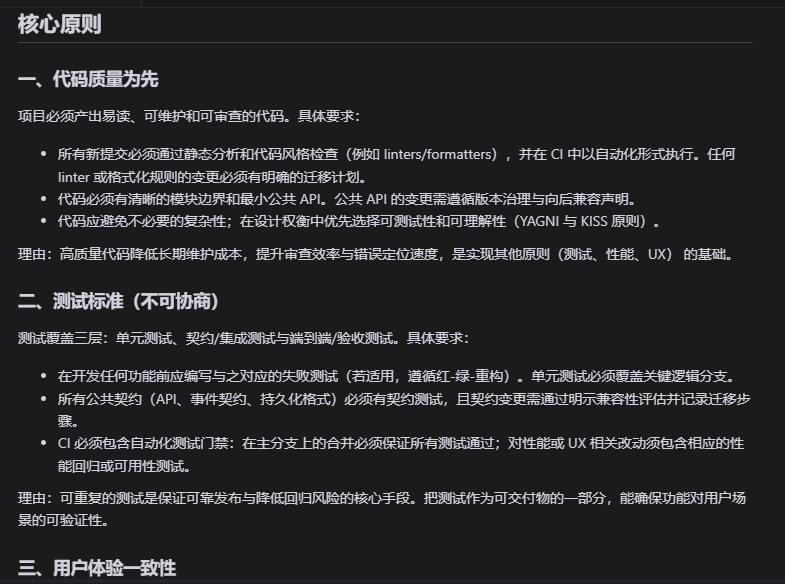

# 3 创建项目需求

```
/speckit.specify 设计一个数据资产售卖应用
```
CodeBuddy会自动创建一个目录 ./spec/001-data-asset-marketplace。后续所有相关的需求、计划等文档都在该目录下。本步骤创建两个文档：spec.md和requirement.md。

规范创建过程中，AI会问一些需要澄清的问题，务必回答清楚。
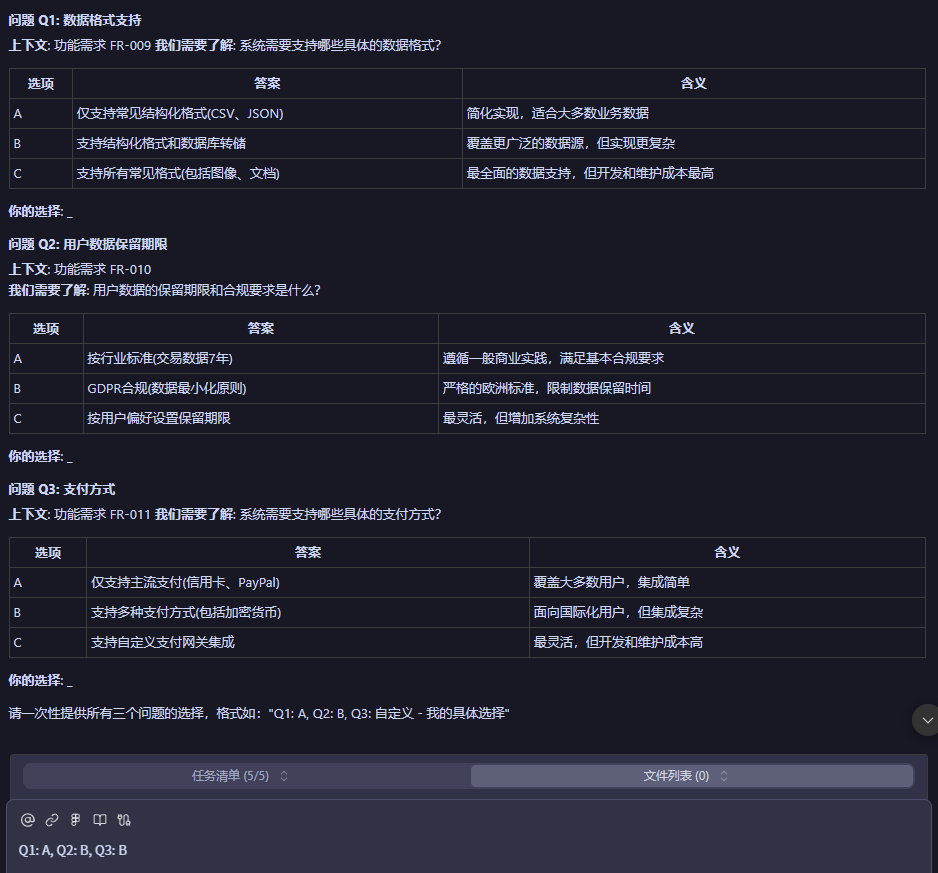

回答完成后，AI助手会继续完善spec.md文件。
**spec.md文件是整个项目的核心，必须仔细阅读。*
*

建议组织团队进行以下检查：

1. 用户故事是否真实和齐全；

2. 功能定义是否真实和齐全

3. 成功衡量标准是否准确

**检查requirement.md文件**
该文件是针对spec.md文件的质量检查清单，评估spec.md文档质量。

针对spec.md文件的修改，可以通过手工修改，修改完成后可以通过/speckit.checklist检查文档质量。

创建好的spec.md文件内容如下：

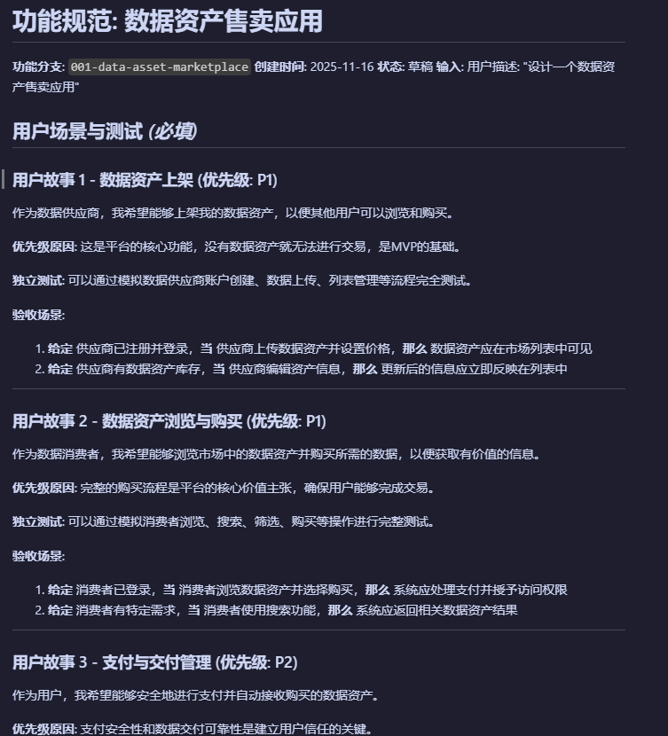

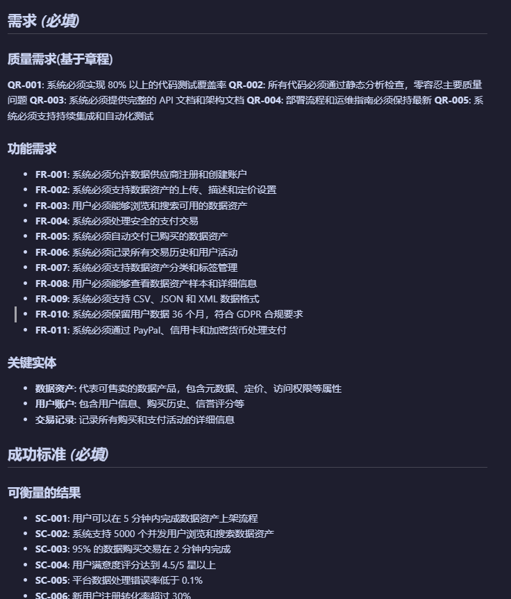

# 4 UED交互设计

交互设计有两种，如果已有Figma文件，则直接使用，导入Figma文件方法参见 [使用CodeBuddy导入Figma文件](https://docs.spec.xin/vendor/figma)。

如果没有设计文件，可以要求AI租售生成设计文件。

```
在根目录下新建一个文件夹，根据需求生成UI界面，要求所有的功能都包含，并且符合spec.md的用户故事的描述。使用静态html，css，javascript构建。模仿Trae的设计，https://tree.com。
```
这里注意要求使用静态html，css，javascript构建，不能使用框架。否则安装依赖时间会非常长。

系统会创建一个UI文件夹，包含所有的html，css，javascript文件。可以直接使用浏览器查看效果；如果不满意，使用提示词修正。注意这里需要检查每一个功能，后续设计将作为重要参考。

# 计划阶段

```
/speckit.plan 严格按照spec.md的要求，并使用UED目录下的界面设计，做一个完整的计划。使用React + Supabase + Stripe技术栈。
```
项目计划阶段可以指定技术栈，例如React + Supabase + Stripe。
计划可能分为两个阶段：

1. 完成研究不确定技术问题（research.md），确定技术栈，并生成plan.md文件。

2. 根据plan.md生成数据结构文件（data-structure.md）和接口定义文件（api.md）

有时也会合并成一个阶段,AI助手会进行提醒。

生成的data-model.md文件是数据结构的详细定义，建议进行团队评审（可选）。

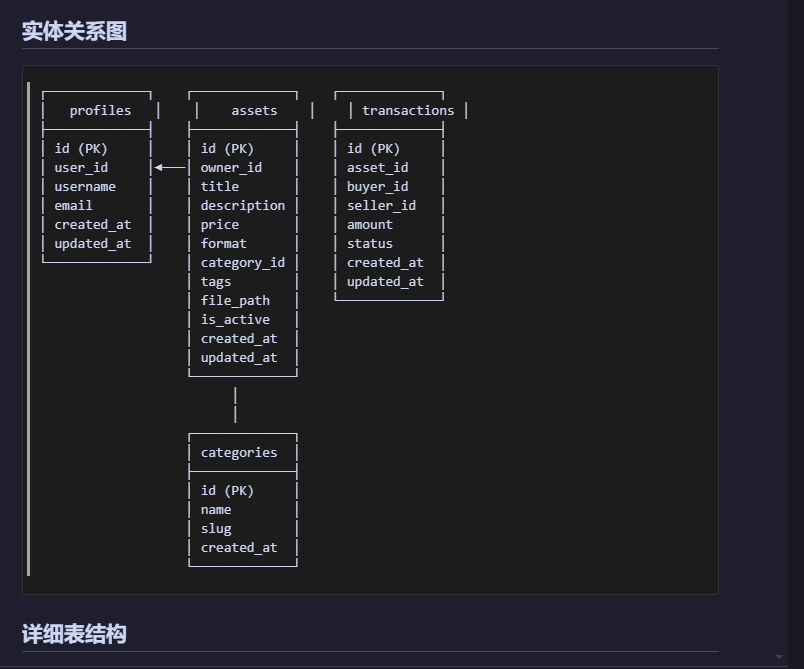

生成的contacts包含所有的对外接口定义，建议进行团队评审（可选）。

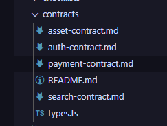

项目计划文档spec.md和quickstart.md建议进行团队评审。

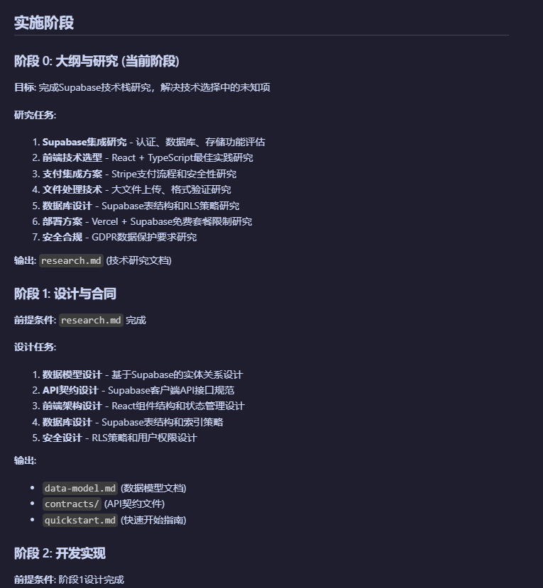

# 5 任务分解

```
/speckit.task 严格按照plan.md的要求，分解任务。
```

任务自动按优先级分解，主要检查任务是否具体指定到文件操作上。

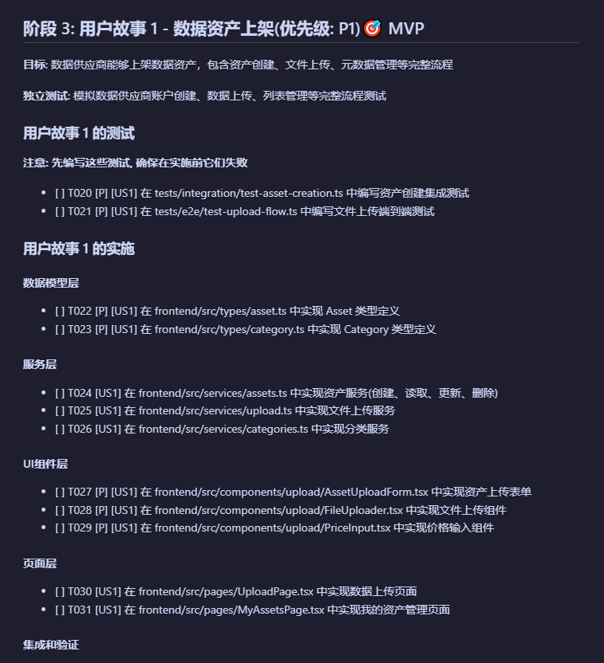

在执行任务之前，做一次一致性检查，检查任务是否与spec.md和UED的设计一致。

```
/speckit.analyze 分析一致性，特别是与spec.md和UED的一致性。
```
该命令检查出以下问题：
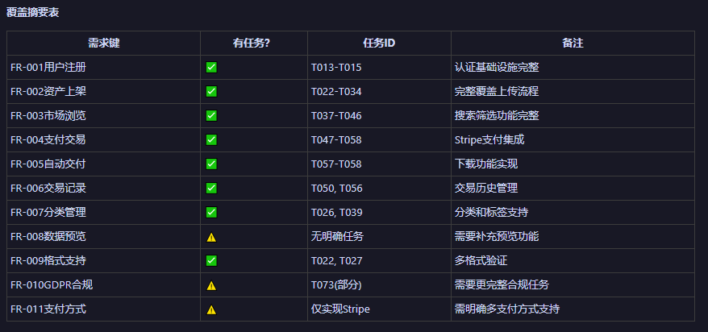

通过提示词提示AI修正这些问题，不能确认的要求AI助手自己填充答案。

# 5 任务执行

```
/speckit.implement 按照tasks.md的要求，实现任务。前端界面设计和交互需要和UED文件夹下的设计一致。
```
任务执行时间较长，预计在3小时内完成。

Supabase如果已经连接，AI助手可以自动帮你拿到url和api key，填入到.env文件中。
如果没有自动连接，需要登录到Supabase控制台，获取url和api key，填入到.env文件中。

Supabase默认使用Email登录，但是需要验证，AI创建的的Email无法验证。可以通过配置Supabase的Email验证，保证用户可以登录：
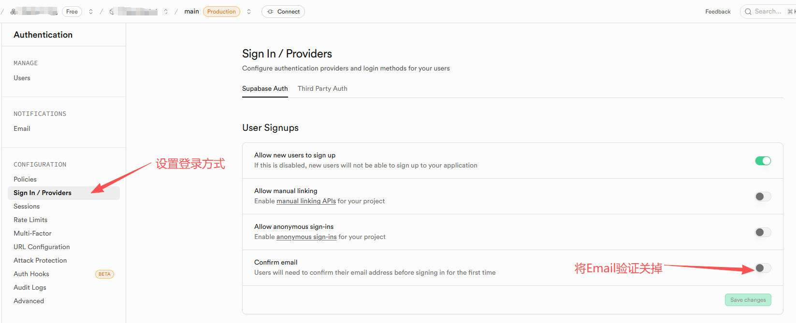

任务执行完成后，需要手动修复明显的问题，例如明显的显示不正确，交互异常等，数据库数据等，这可能要花费2个小时左右。

注：在实现项目过程中，在AI助手遇到token使用超额，系统缓慢等问题，可以关闭当前对话，新建对话。输入以下提示词继续实现任务：
```
/speckit.implement 检查tasks.md的实现情况，继续后几个阶段的开发。
```
# 6 项目效果
用户名：admin@datamarketplace.com

密码：admin123456


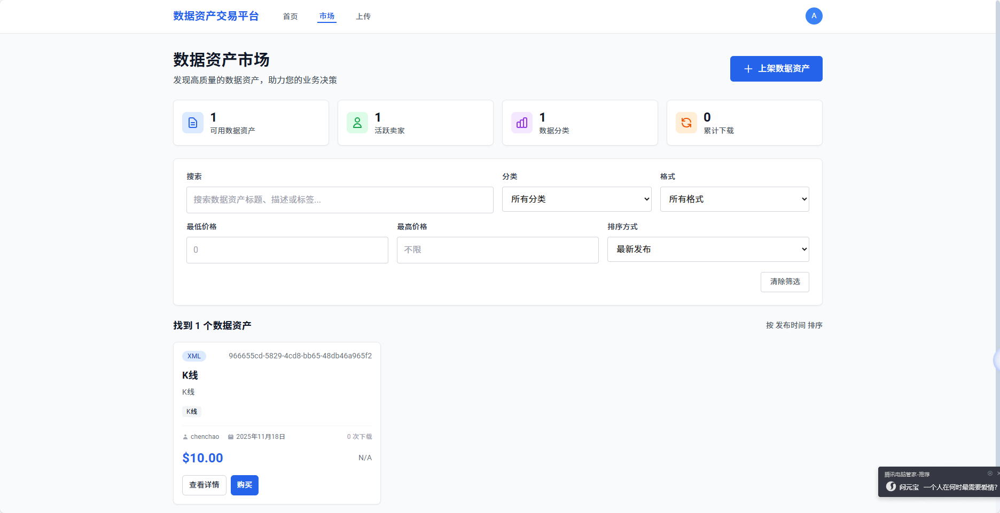

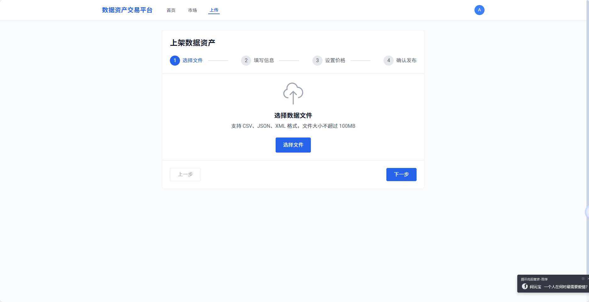

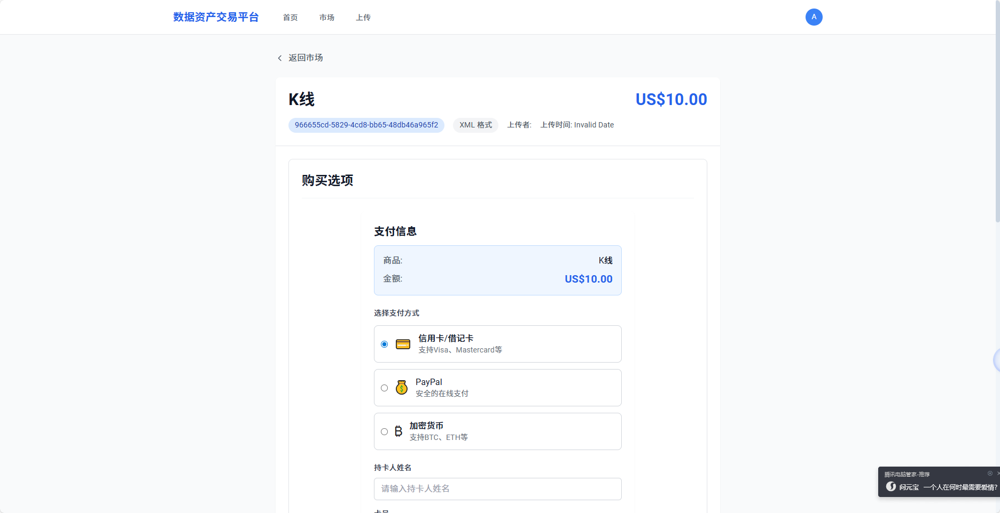


