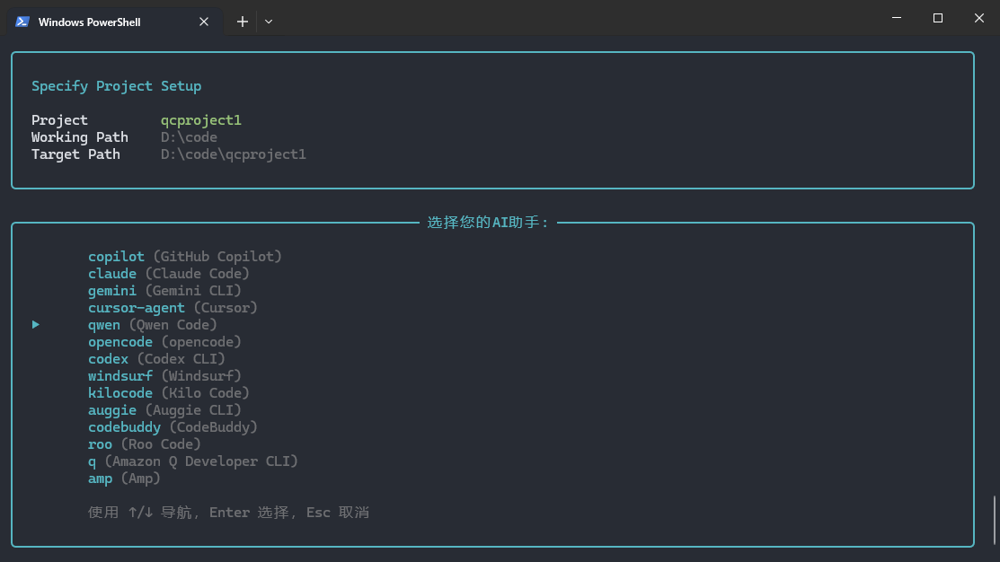
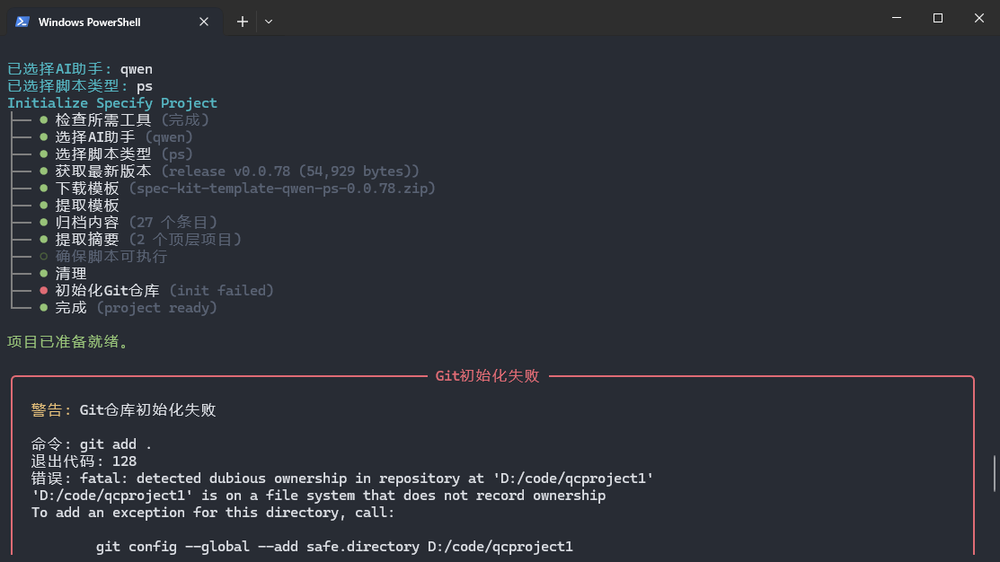
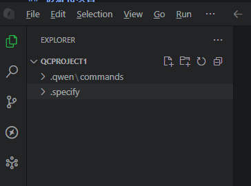
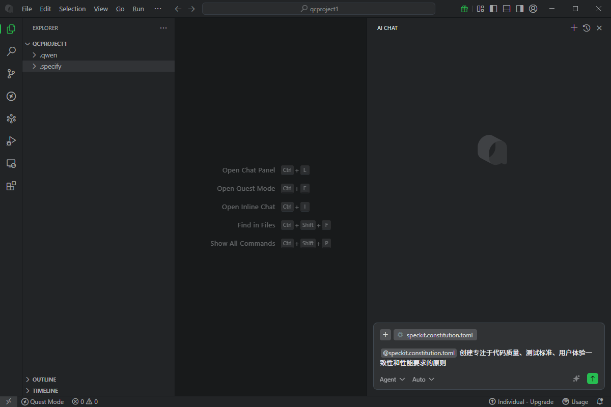

# QCoder

## 安装speckit中文优化版
打开终端，输入以下命令安装speckit中文优化版：
```
uv tool install specify-cn-cli --from git+https://gitcode.com/favornwpu/spec.kit.cn.git
```
安装后，输入以下命令检查是否安装成功：
```
specify-cn --help
```

安装成功后shell输出的结果如下：

```
                            ███████╗██████╗ ███████╗ ██████╗██╗███████╗██╗   ██╗
                            ██╔════╝██╔══██╗██╔════╝██╔════╝██║██╔════╝╚██╗ ██╔╝
                            ███████╗██████╔╝█████╗  ██║     ██║█████╗   ╚████╔╝
                            ╚════██║██╔═══╝ ██╔══╝  ██║     ██║██╔══╝    ╚██╔╝
                            ███████║██║     ███████╗╚██████╗██║██║        ██║
                            ╚══════╝╚═╝     ╚══════╝ ╚═════╝╚═╝╚═╝        ╚═╝

                            Spec Kit- 规范驱动开发中文优化工具包-http://spec.xin


 Usage: specify-cn [OPTIONS] COMMAND [ARGS]...

 Spec Kit CN 规范驱动开发项目设置工具

Usage: specify-cn --help
Spec Kit CN 规范驱动开发项目设置工具
```

对于已经安装的speckit中文优化版，输入以下命令更新到最新版本：
```
uv tool install specify-cn-cli --force --from git+https://gitcode.com/favornwpu/spec.kit.cn.git
```
注：也可以使用https://github.com/figoliu/spec.xin作为安装源，输入以下命令安装：
```
uv tool install specify-cn-cli --force --from git+https://github.com/figoliu/spec.xin.git
```
## 初始化项目
先安装qwen-code的CLI工具，必须安装，否则不能使用qwen-code的功能。

```
npm install -g @qwen-code/qwen-code@latest
```
注：如果没有安装nodejs，则需先安装nodejs：
```
curl -qL https://www.npmjs.com/install.sh | sh
```

输入以下命令初始化项目：
```
specify-cn init qcproject1
```
qcproject1是你的项目名称。


Specify默认支持qwen-code，按Enter键确认。
然后选择使用的脚本类型，一般Windows上选择PS（PowerShell），Linux上选择Bash。按Enter键确认。


项目会自动开始初始化，初始化完成后，会在当前目录下创建一个名为qcproject1的文件夹，里面包含了项目的所有文件。



注意这里有一个Git初始化出错的问题，可以先忽略，后续再修正。也可以进入qcproject1文件夹，手动初始化Git仓库。

```
git config --global --add safe.directory D:/code/qcproject1
cd qcproject1
git init
```


## 使用qwen-code进行SDD开发

打开qwen-code，选择Open Folder，选择qcproject1文件夹，即可打开项目。


在项目的资源管理器中看到这两个文件夹，表示项目准备就绪，可以开始进行SDD开发。

在qwen-code右侧的AI交互区域，输入想要进行的SDD步骤，即可进行SDD开发。



注意qwen-code中与AI交互需要输入"@"号，本例中输入"@speckit.constitution.toml"，即可生成项目章程。

具体的SDD步骤可以参考[Spec Kit CN 规范驱动开发项目设置工具](https://gitcode.com/favornwpu/spec.kit.cn)中的说明。

SDD开发示例参见exmaple的教程。