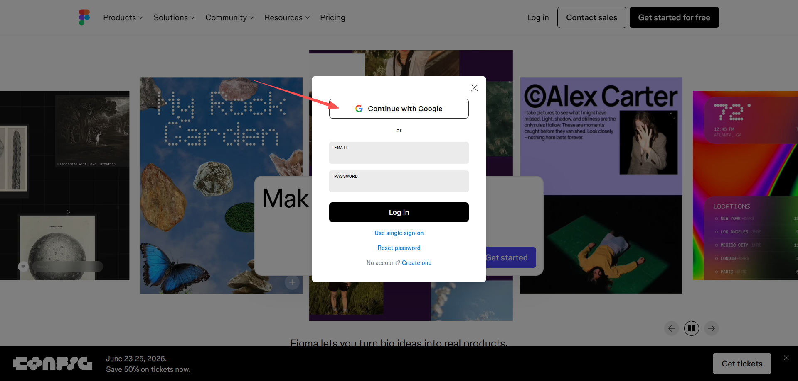
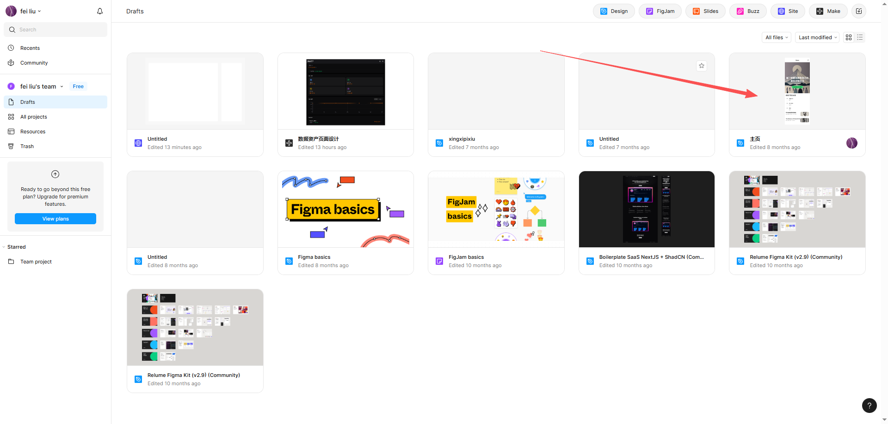
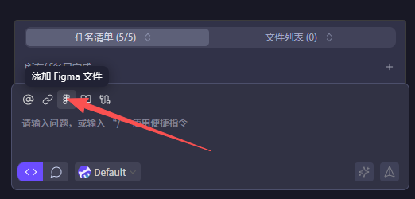
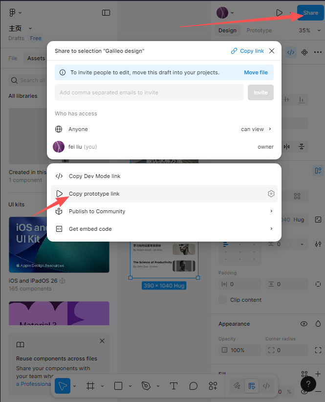

Figma是一个基于浏览器的矢量图形设计工具，提供了强大的设计功能和协作工具。在项目中使用Figma可以快速设计出符合需求的界面。
# 1 注册Figma账号
首先，需要注册一个Figma账号。访问[Figma官网](https://www.figma.com/)，填写邮箱、密码等信息进行注册。

登录进系统后创建新组织，使用免费的额度即可。
# 2 使用Figma进行UI设计
Figma提供了丰富的模板，以及自然语言的设计功能。可以根据项目需求，选择合适的模板进行设计。设计完成后，可以导出设计文件，或者与团队成员共享设计。

# 3 在CodeBuddy中使用Figma设计
CodeBuddy可以直接在浏览器中打开Figma，进行设计。在CodeBuddy中，选择“添加Figma文件”。

CodeBuddy会打开Figma项目页面，你可以直接在CodeBuddy中进行设计。

完成设计后点击”share“按钮，再点击”copy protypelink“，将链接复制到CodeBuddy中。

CodeBuddy会显示Figma链接，你可以直接在CodeBuddy中使用该链接，生成可以执行的前端代码。