Supabase是一个基于PostgreSQL的后端服务，提供了数据库、认证、存储、实时功能等，他提供了足够小项目使用的免费额度。在项目中使用Supabase可以快速搭建后端服务，减少开发成本。
# 1 注册Supabase账号
首先，需要注册一个Supabase账号。访问[Supabase官网](https://supabase.com/dashboard/)，填写邮箱、密码等信息进行注册。
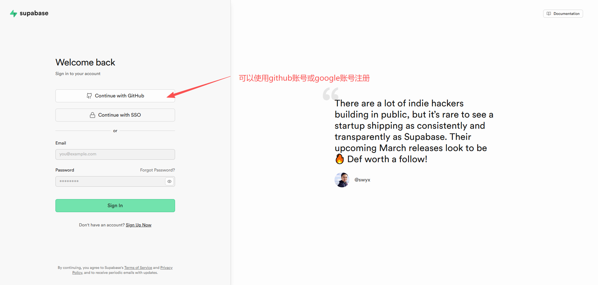
登录进系统后创建新组织，使用免费的额度即可。
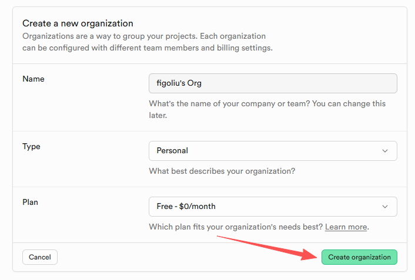

免费的额度足够满足一般项目的需求。
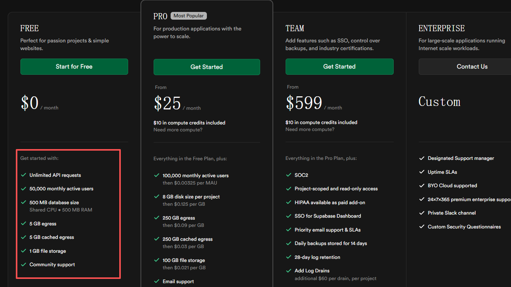

然后创建一个项目，需要填写项目名称、数据库密码等信息。
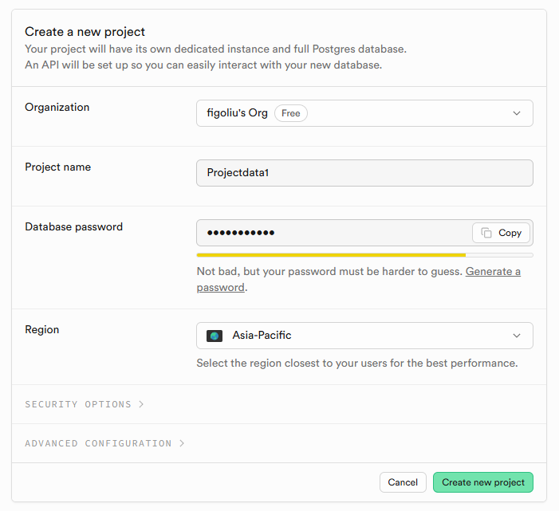

项目创建成功，你可以使用Supabase提供的免费数据库服务了。
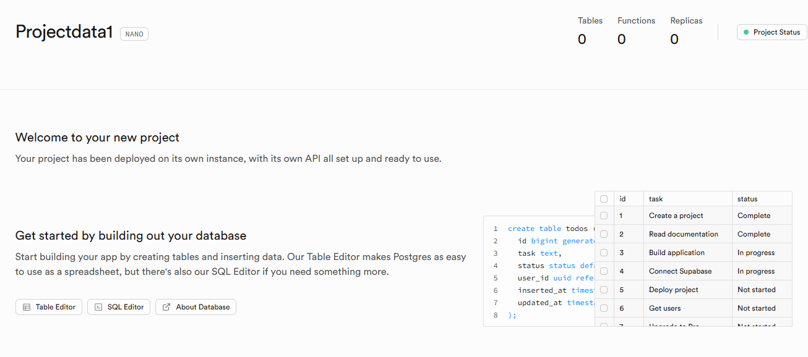

# 2 连接Supabase数据库

CodeBuddy可以直接连接到Supabase数据库，进行数据库操作。下面在CodeBuddy中连接到Supabase数据库。

在CodeBuddy中AI对话框上方，，点击“配置集成”菜单，选择“Supabase”。
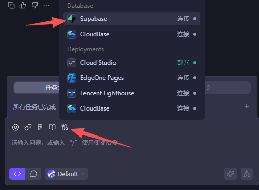

CodeBuddy打开Supabase登录页面，使用Supabase账号登录。
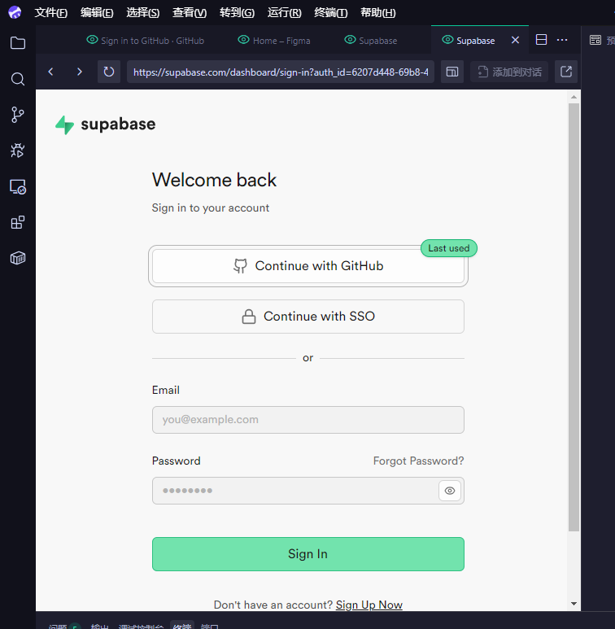

授权CodeBuddy访问Supabase项目。
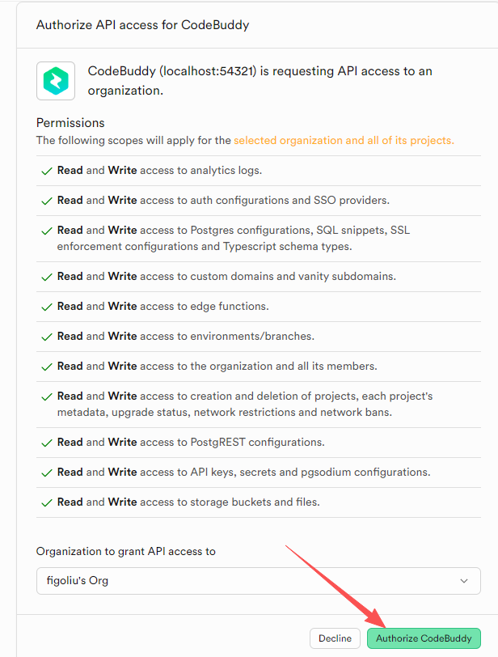

选择已创建的数据库或者新建数据库。

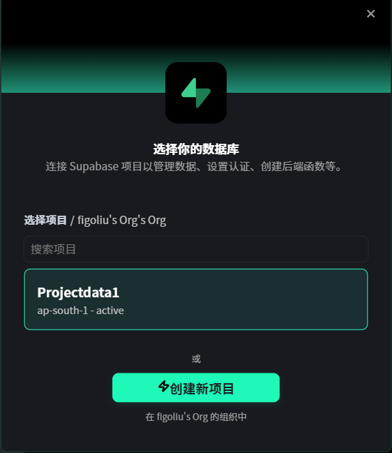

连接项目：
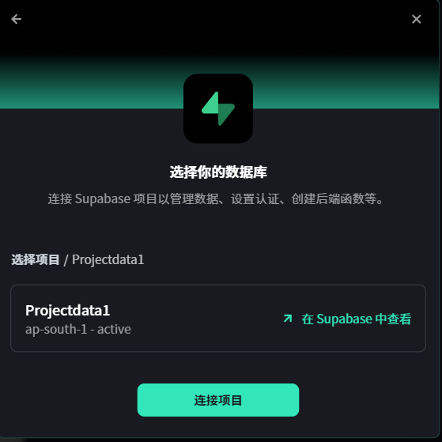

最后在CodeBuddy中，显示连接成功，就可以使用Supabase数据库了。
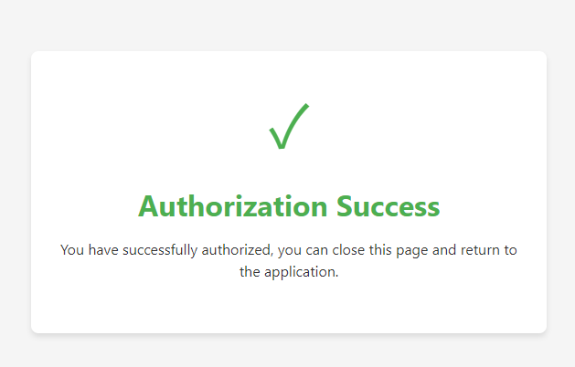